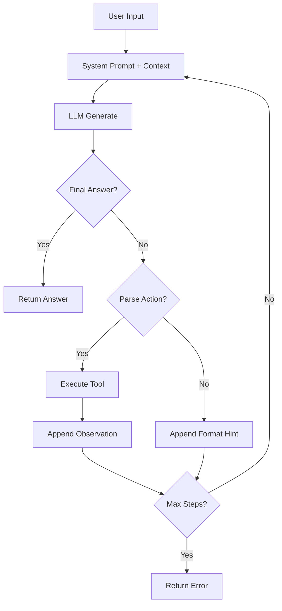

# 🍜 HƯỚNG DẪN TEAM — Trợ Lý Đi Chợ Thông Minh (FINAL)

> **Lab 3: Chatbot vs ReAct Agent**  
> 3 tiếng thực làm (12:00–13:00, 14:00–16:00)  
> Team: 3 người — 1 Frontend + 2 Backend

---

## PHÂN CÔNG

| Người | Vai trò | Files chính |
|-------|---------|-------------|
| **A — Frontend** | Gradio UI + flowchart | `app.py`, flowchart cho report |
| **B — Backend Data** | 4 tools, mock data, chatbot baseline | `src/tools/grocery_tools.py`, `src/chatbot.py` |
| **C — Backend Logic** | ReAct agent, testing, evaluation | `src/agent/agent.py`, `tests/*`, `main.py` |

---

## TIMELINE

```
12:00 ─── Setup chung (15 phút)
12:15 ─── PHASE 1: Build song song (45 phút)        ← code chính
13:00 ─── 🍚 Nghỉ trưa
14:00 ─── PHASE 2: Merge + chạy v1 (30 phút)        ← integration
14:30 ─── PHASE 3: Fix + v2 + gaps (45 phút)         ← cải thiện + bù gaps
15:15 ─── PHASE 4: Report + demo (45 phút)            ← documentation
16:00 ─── NỘP
```

---

## CÁC THAY ĐỔI SO VỚI BẢN TRƯỚC (4 gaps đã fix)

1. **tracker.track_request()** đã thêm vào cả `agent.py` lẫn `chatbot.py` → log sẽ có `LLM_METRIC` events mà instructor tìm kiếm (+3 bonus monitoring)
2. **Provider switching** đã tích hợp vào `run_tests.py` → tự chạy thêm provider thứ 2 nếu có key (instructor success metric)
3. **Flowchart** giao A vẽ trong Phase 4 bằng Mermaid → đính kèm group report (5 điểm base)
4. **Tool Design Evolution** B lưu v1 descriptions, cải thiện trong Phase 3 → paste diff vào report (4 điểm base)

---

## PHASE 1 — BUILD SONG SONG (12:15 → 13:00)

> Flow chính không thay đổi. Mỗi người code file riêng.

### 👤 A — Frontend (Gradio)

Install: `pip install gradio` + thêm `gradio>=4.0.0` vào requirements.txt.

Viết `app.py` ở root. Code có 3 tab: Agent chat, Chatbot chat, So Sánh side-by-side.

Xem code đầy đủ trong bản guide trước — không thay đổi.

> ⏰ Checkpoint A (13:00): app.py viết xong, commit.

---

### 👤 B — Backend Data

Viết 2 file: `src/tools/grocery_tools.py` + `src/chatbot.py`.

**QUAN TRỌNG cho chatbot.py**: thêm `from src.telemetry.metrics import tracker` và gọi `tracker.track_request(...)` sau mỗi lần gọi LLM:

```python
from src.telemetry.metrics import tracker  # ★ THÊM

# Sau result = self.llm.generate(...)
tracker.track_request(
    provider=result.get("provider", "unknown"),
    model=self.llm.model_name,
    usage=result.get("usage", {}),
    latency_ms=result.get("latency_ms", 0),
)
```

**QUAN TRỌNG cho grocery_tools.py**: Copy TOOL_REGISTRY v1 ra 1 chỗ (comment, file tạm, hoặc ghi chú) trước khi sửa trong Phase 3. Cần cho "Tool Design Evolution" trong report.

> ⏰ Checkpoint B (13:00): 2 file xong, commit.

---

### 👤 C — Backend Logic

Viết 4 file: `src/agent/agent.py`, `tests/test_scenarios.py`, `tests/run_tests.py`, `main.py`.

**QUAN TRỌNG cho agent.py**: thêm `from src.telemetry.metrics import tracker` và gọi `tracker.track_request(...)` sau MỖI lần gọi LLM trong ReAct loop.

**QUAN TRỌNG cho run_tests.py**: Thêm provider switching — nếu có key provider thứ 2, tự chạy thêm 3 test case tiêu biểu với provider đó. Code:

```python
def get_llm(provider_override=None):
    provider = provider_override or os.getenv("DEFAULT_PROVIDER", "openai")
    if provider == "google":
        from src.core.gemini_provider import GeminiProvider
        return GeminiProvider(
            model_name=os.getenv("DEFAULT_MODEL", "gemini-1.5-flash"),
            api_key=os.getenv("GEMINI_API_KEY"),
        )
    from src.core.openai_provider import OpenAIProvider
    return OpenAIProvider(
        model_name=os.getenv("DEFAULT_MODEL", "gpt-4o-mini"),
        api_key=os.getenv("OPENAI_API_KEY"),
    )

# Trong run_all():
# Sau khi chạy xong provider 1, kiểm tra key provider 2
provider2 = "google" if provider1 == "openai" else "openai"
key2 = os.getenv("GEMINI_API_KEY" if provider2 == "google" else "OPENAI_API_KEY")
if key2 and "your_" not in key2:
    llm2 = get_llm(provider2)
    # Chạy 3 test cases tiêu biểu: S1, M2, E1
```

> ⏰ Checkpoint C (13:00): 4 file xong, commit.

---

## PHASE 2 — MERGE + TEST V1 (14:00 → 14:30)

```bash
git pull
pip install gradio
python main.py          # terminal test
python app.py           # Gradio → http://localhost:7860
```

Kiểm tra logs: `grep LLM_METRIC logs/*.log` — phải thấy events.

---

## PHASE 3 — FIX + V2 + BÙ GAPS (14:30 → 15:15)

### C: Agent v2 prompt

Thêm few-shot example + priority rules vào cuối system prompt. Commit: `fix(C): v2 prompt`

### B: Tool descriptions v2 (★ 4 điểm base)

Cải thiện descriptions. Ví dụ:

```
v1: "Tìm công thức nấu ăn. Input: tên món. Output: nguyên liệu, khẩu phần, thời gian."
v2: "Tìm công thức nấu ăn Việt Nam theo tên. Input: tên món bằng tiếng Việt
     (vd: 'phở bò', 'bún bò Huế'). Output: JSON gồm name, servings (int),
     ingredients (list of {item, quantity}), time. Trả lỗi nếu không tìm thấy."
```

Làm tương tự 4 tools. Lưu cả v1 lẫn v2 vào report. Commit: `fix(B): v2 tool descriptions`

### C: Chạy lại tests v2

```bash
cp tests/results.json tests/results_v1.json
# sau khi code v2 xong
python tests/run_tests.py
cp tests/results.json tests/results_v2.json
```

---

## PHASE 4 — REPORT + DEMO (15:15 → 16:00)

### A: Flowchart (★ 5 điểm base)

Tạo `report/flowchart.md`:

````markdown
# ReAct Agent Flowchart



## Group Insights
- Chatbot giỏi câu simple (nhanh, rẻ token)
- Agent thắng ở multi-step (chính xác, dùng tool)
- Lỗi phổ biến nhất: parse error khi LLM không tuân format
````

### Group Report — phân viết

| Section | Ai | Phút |
|---------|-----|------|
| 1. Executive Summary | C | 5 |
| 2. Architecture + Tool Inventory | B | 10 |
| 3. Telemetry (từ results.json + logs) | C | 10 |
| 4. RCA — Failure Traces | C | 10 |
| 5. Ablation v1 vs v2 + Tool Evolution diff | B | 10 |
| 6. Flowchart + Production Readiness | A | 10 |

### Individual Report — mỗi người tự viết

File: `report/individual_reports/REPORT_[TÊN].md`

| Phần | Điểm | Gợi ý |
|------|------|-------|
| I. Technical Contribution | 15 | Liệt kê file, function, dòng code |
| II. Debugging Case Study | 10 | 1 lỗi từ log → trace → giải thích → fix |
| III. Chatbot vs Agent Insights | 10 | Khi nào dùng cái nào, tại sao |
| IV. Future Improvements | 5 | RAG, real DB, multi-agent... |

### Live Demo (+5 bonus)

Tab **📊 So Sánh** trên Gradio:
1. "Phở bò cần gì?" → cả hai OK
2. "Bún bò Huế, hết thì thay, tính giá" → Agent thắng

---

## CHECKLIST TRƯỚC KHI NỘP

```
CODE:
☐ main.py chạy OK
☐ app.py (Gradio) chạy, 3 tab
☐ grep LLM_METRIC logs/*.log → có events
☐ tests/results_v1.json + results_v2.json

REPORT:
☐ GROUP_REPORT_[TEAM].md
    ☐ Flowchart (5đ base)
    ☐ Tool desc v1 vs v2 diff (4đ base)
    ☐ Bảng chatbot vs agent (7đ base)
    ☐ ≥1 failure trace (9đ base)
☐ REPORT_A.md, REPORT_B.md, REPORT_C.md

GIT:
☐ commit history: feat(A/B/C), fix(A/B/C)
```

## CẤU TRÚC

```
repo/
├── app.py                    ← A
├── main.py                   ← C
├── src/
│   ├── agent/agent.py        ← C (có tracker)
│   ├── chatbot.py            ← B (có tracker)
│   ├── core/                 ← KHÔNG SỬA
│   ├── telemetry/            ← KHÔNG SỬA
│   └── tools/
│       ├── __init__.py       ← B
│       └── grocery_tools.py  ← B
├── tests/
│   ├── test_scenarios.py     ← C
│   ├── run_tests.py          ← C (có provider switching)
│   ├── results_v1.json
│   └── results_v2.json
├── logs/                     ← auto (có LLM_METRIC)
└── report/
    ├── flowchart.md          ← A
    ├── group_report/GROUP_REPORT_[TEAM].md
    └── individual_reports/REPORT_{A,B,C}.md
```
