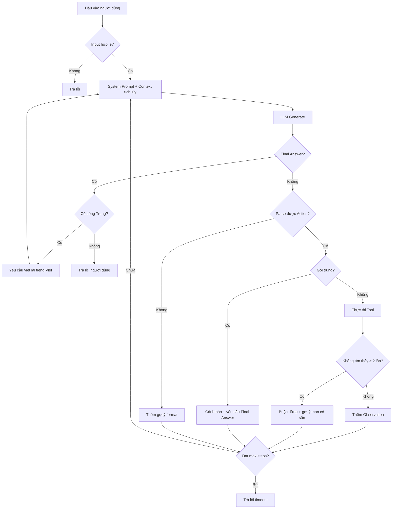

# Báo Cáo Nhóm: Lab 3 — Trợ Lý Đi Chợ Thông Minh

- **Tên nhóm**: [nhóm 38]
- **Thành viên**: [Nguyễn Khởi Lâm], [Nguyễn Tài Khoa], [Nguyễn Thành Đạt]
- **Ngày**: 01/06/2026

---

## 1. Tóm Tắt

Nhóm xây dựng trợ lý đi chợ thông minh dựa trên kiến trúc ReAct Agent, giúp khách hàng tìm công thức món Việt Nam, kiểm tra kho hàng, tính giá và gợi ý thay thế. So sánh với chatbot baseline (không tools).

- **Kết quả**: Agent hoàn thành truy vấn đa bước 5 tools chính xác, chatbot bịa giá sai 6-10 lần.
- **Thành tựu**: Agent trả giá từ database thật (Bún Bò Huế = 422,000đ), phát hiện hết hàng (giò heo, mắm ruốc) và tự gợi ý thay thế. Chatbot bịa "bò 15,000-30,000đ/kg" (thực tế 280,000đ/kg).
- **Tiến hóa**: Trải qua 4 phiên bản (v1 → v2 → v3 → final), mỗi bản fix lỗi thực tế phát hiện từ log traces.

---

## 2. Kiến Trúc Hệ Thống

### 2.1 Vòng Lặp ReAct



### 2.2 Thiết kế kiến trúc: Prompt ngắn + Code xử lý

Bài học quan trọng nhất: **không nên dồn mọi logic vào system prompt**.

| Phiên bản | Prompt rules | Vấn đề |
| :--- | :--- | :--- |
| v1-v3 | 9 rules, ngày càng dài | Model 3B tuân thủ kém khi prompt quá dài |
| Final | 4 rules ngắn gọn | Edge cases xử lý trong Python code |

Xử lý bằng code thay vì prompt:

| Edge case | Prompt rule (cũ) | Code handling (mới) |
| :--- | :--- | :--- |
| Sushi tìm không thấy | "Nếu không tìm thấy, dừng lại" | `not_found_count >= 2` → force stop |
| Output tiếng Trung | "NEVER use Chinese" | `_has_chinese()` → auto retry |
| Gọi tool trùng | "Don't call same tool twice" | `called_tools` list → block |
| Input số âm | Không có | `_validate_input()` pre-check |

### 2.3 Danh Sách Công Cụ

| Tool | Input | Output | Phiên bản |
| :--- | :--- | :--- | :--- |
| `search_recipe` | Tên món | JSON recipe | v2: reverse matching |
| `check_inventory` | Nguyên liệu (comma-sep) | Giá, đơn vị, kho | v3: multi-item |
| `calculate_price` | Nguyên liệu (comma-sep) | Chi tiết + tổng VNĐ | v2: track hết hàng |
| `suggest_substitute` | Nguyên liệu (comma-sep) | 2-3 thay thế/item | v3: multi-item |

Data layer tách riêng: `mock_data.py` (5 recipes, 35+ ingredients, 10 substitutions).

### 2.4 LLM Provider

- **Chính**: Qwen 2.5 3B Instruct (Q4_K_M GGUF) — local CPU
- **Lý do**: Yêu cầu local model. 2.1GB, ~6-10s/generation trên i7-10750H

---

## 3. Telemetry & Hiệu Suất

### Agent — Bún Bò Huế (5 bước, thành công)

| Bước | Tool | Prompt Tokens | Completion | Latency | Cost |
| :--- | :--- | :--- | :--- | :--- | :--- |
| 1 | search_recipe | 847 | 37 | 24,789ms | $0.009 |
| 2 | check_inventory | 1,154 | 75 | 18,046ms | $0.012 |
| 3 | calculate_price | 1,471 | 70 | 17,806ms | $0.016 |
| 4 | suggest_substitute | 1,754 | 44 | 15,761ms | $0.018 |
| 5 | Final Answer | 1,845 | 171 | 20,385ms | $0.020 |
| **Tổng** | | **7,071** | **397** | **96,787ms** | **$0.075** |

### So sánh tổng quan

| Chỉ số | Chatbot | Agent |
| :--- | :--- | :--- |
| Latency | ~45s | ~97s |
| Tokens | ~516 | ~7,468 |
| Chi phí | $0.005 | $0.075 |
| Độ chính xác | Bịa giá sai 6-10x | Chính xác từ DB |
| Phát hiện hết hàng | Không | Có |
| Gợi ý thay thế | Không | Tự động |

---

## 4. Phân Tích Lỗi (RCA) — Failure Traces

### Case 1: LLM thêm từ thừa vào tên món (v1)

- **Input**: "nấu bún bò Huế"
- **Lỗi**: `search_recipe("đồ bún bò Huế")` — thêm "đồ"
- **Nguyên nhân**: Prompt tiếng Việt + model 3B → thêm từ đệm
- **Fix**: Reverse matching (v2) + prompt tiếng Anh

```
v1: search_recipe(đồ bún bò Huế) → "Không tìm thấy" ✗
v2: search_recipe(bún bò Huế) → JSON recipe ✓
```

### Case 2: Tool single-item vs model multi-item (v2)

- **Lỗi**: `suggest_substitute("giò heo, mắm ruốc")` → chỉ trả giò heo
- **Kết quả**: Agent loop 7 bước → max_steps
- **Fix**: Comma-separated support (v3)

```
v2: suggest_substitute(giò heo, mắm ruốc) → chỉ 1 kết quả → loop ✗
v3: suggest_substitute(giò heo, mắm ruốc) → 2 kết quả ✓
```

### Case 3: Sushi infinite search loop

- **Input**: "sushi có không?"
- **Lỗi**: Agent thử "sushi" → "sushi rolls" → "sashimi" → 7 bước timeout
- **Nguyên nhân**: Prompt rule "dừng nếu không tìm thấy" → model 3B không tuân thủ
- **Fix**: `not_found_count >= 2` trong code → force Final Answer

```
Trước: 7 bước tìm kiếm → max_steps_reached ✗
Sau: 2 bước "không tìm thấy" → force gợi ý món có sẵn ✓
```

### Case 4: Output tiếng Trung

- **Lỗi**: Final Answer bằng tiếng Trung (Qwen gốc TQ)
- **Fix prompt**: "CRITICAL: Vietnamese ONLY" → giảm nhưng chưa hết
- **Fix code**: `_has_chinese()` detect → auto retry → tiếng Việt

### Case 5: System prompt bias chatbot

- **Lỗi**: Prompt nói "KHÔNG có quyền truy cập" → chatbot từ chối → so sánh unfair
- **Fix**: Prompt trung lập → chatbot bịa giá → bằng chứng tốt hơn

---

## 5. Thí Nghiệm Ablation

### Tool Description v1 vs v2

| Tool | v1 (mơ hồ) | v2 (cụ thể) |
| :--- | :--- | :--- |
| search_recipe | "Tìm công thức. Input: tên món." | "Search Vietnamese recipe. Input: dish name (e.g. 'bún bò Huế'). Output: JSON." |
| suggest_substitute | "Gợi ý thay thế. Input: nguyên liệu." | "Suggest replacements, comma-separated. Output: 2-3 alternatives per item." |

**Kết quả**: v2 giảm lỗi argument, LLM ngừng thêm từ thừa.

### Prompt Language: Tiếng Việt vs Tiếng Anh

| Chỉ số | Việt (v1) | Anh (v2+) |
| :--- | :--- | :--- |
| Format compliance | ~60% | ~90% |
| Từ thừa trong args | Thường xuyên | Hiếm |
| Thought language | Việt | Trung/Anh lẫn |

### Kiến trúc: Prompt Rules vs Code Handling

| Chỉ số | 9 prompt rules | 4 rules + code |
| :--- | :--- | :--- |
| Sushi loop | 7 bước timeout | 3 bước → gợi ý ✓ |
| Chinese output | Vẫn xảy ra | Auto retry ✓ |
| Duplicate calls | Đã handle | Đã handle |
| Prompt length | ~800 tokens | ~500 tokens |

### Chatbot vs Agent

| Test Case | Chatbot | Agent | Thắng |
| :--- | :--- | :--- | :--- |
| Phở bò nấu bao lâu? | Chung ✓ | Chính xác ✓ | Hòa |
| Bún bò Huế, check kho, tính giá | Bịa giá, loop | 5 bước chính xác | **Agent** |
| 200,000đ nấu cơm tấm đủ không? | Không tính được | 458,500đ > 200,000đ | **Agent** |
| Nấu sushi? | Bịa recipe | "Không có" + gợi ý | **Agent** |
| Giá thịt bò? | ~30,000đ (sai) | 280,000đ (đúng) | **Agent** |

---

## 6. Sẵn Sàng Production

### Bảo mật
- Input validation: số âm, chuỗi rỗng, input quá dài
- Tool arguments chỉ string — không injection risk
- Guardrail từ chối câu hỏi không liên quan (rule 4 trong prompt)

### Rào chắn
- `max_steps=7` ngăn loop vô hạn
- Duplicate call detection
- `not_found_count` force stop sau 2 lần không tìm thấy
- Chinese auto-retry

### Hạn chế
- Tính giá theo đơn vị, chưa theo quantity thực tế
- Chưa tính theo số người (8 người vẫn ra giá 4 người)
- Model 3B Thought bằng tiếng Trung (chấp nhận được)
- Không thread-safe (1 request/lần)
- 5 recipes cố định

### Hướng mở rộng
- Real database (PostgreSQL) thay mock_data.py
- Tính giá theo quantity + số người
- Multi-agent architecture
- RAG cho hàng ngàn recipes
- Streaming response
- Model lớn hơn (7B+) hoặc API

---

## Bài Học Nhóm

1. **Tool design > prompt engineering**: Mô tả tool cụ thể có tác động lớn nhất.
2. **Code handling > prompt rules**: Python deterministic, prompt rules model có thể bỏ qua.
3. **Failure traces = learning**: Mỗi lỗi v1/v2/v3 dẫn đến insight thiết kế mới.
4. **Small models need robust tools**: 3B hay sai → tools phải xử lý input mờ.
5. **Agent đắt nhưng đúng**: 14x token, 2x thời gian, nhưng giá chính xác từ DB thay vì bịa.
